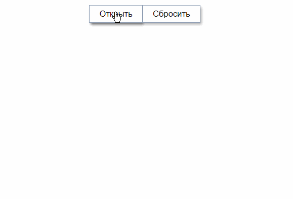

# Range-Picker component React



## Demo:

[https://asosunoff.github.io/React-Range-Picker/](https://asosunoff.github.io/React-Range-Picker/)

### Launch project:

```
git clone https://github.com/aSosunoff/React-Range-Picker.git
cd React-Range-Picker
npm i
npm run start
```

### Test project:

```
npm test
```
